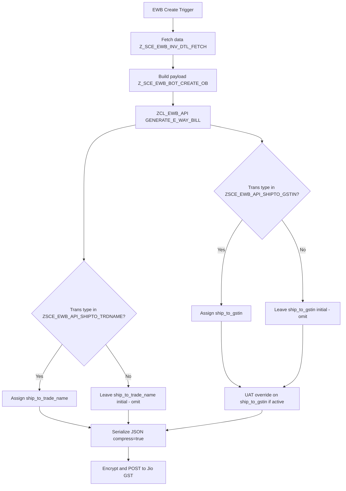

# SAP Functional Specification
## E-Way Bill Enhancement — shipToGSTIN & shipToTradeName (Approach 2)

| Field | Value |
|-------|-------|
| **Document ID** | FS-EWB-SHIPTO-001 |
| **System** | SAP RD2 |
| **Module** | ZLOG / E-Way Bill (EWB) |
| **Version** | 1.0 |
| **Date** | 04-Jun-2026 |
| **Status** | Approved for Development |

---

## 1. Document control

| Version | Date | Author | Description |
|---------|------|--------|-------------|
| 1.0 | 04-Jun-2026 | Cursor / Gaurav Prabhu | Initial functional specification |

---

## 2. Purpose

This document describes the functional requirement to enhance the SAP E-Way Bill (EWB) generation API integration with Jio GST by:

1. Adding **`shipToGSTIN`** and **`shipToTradeName`** to the Generate E-Way Bill JSON payload per the Jio GST schema.
2. Removing legacy fields **`df_gstin`** and **`sh_gstn`** from the API payload (not present in the current Jio GST schema).
3. Controlling each new field **independently** via configuration in **`ZLOG_EXEC_VAR`** (Approach 2).
4. **Omitting** fields from JSON when the configured transaction type does not apply (recommended API practice).

---

## 3. Background

### 3.1 Current process

Outbound E-Way Bill creation in RD2 follows this flow:

```
ZSCE_EWB / Z_SCE_EWB_BOT_CREATE_OB (etc.)
  → Z_SCE_EWB_INV_DTL_FETCH (fetch invoice/shipment data)
  → Z_SCE_EWB_BOT_CREATE_OB (build payload)
  → ZCL_EWB_API=>GENERATE_E_WAY_BILL (map JSON, encrypt, POST)
  → Jio GST API (via JIOGST / JIOGSTV2 destination)
```

**Note:** `ZSCE_EWB_BOT_ACTIVE` is **not active** in UAT or Production. All changes apply to the **direct API path** (`ZCL_EWB_API`).

### 3.2 Jio GST schema reference

The Jio GST Generate E-Way Bill JSON schema includes:

- **`shipToGSTIN`** — GSTIN of Ship-To (optional, max 15 chars)
- **`shipToTradeName`** — Trade name of Ship-To (optional, max 100 chars)

The schema does **not** include:

- `df_gstin` / `dfGstin`
- `sh_gstn` / `shGstn`

---

## 4. Business requirement

When the bill-to party and ship-to party differ (specific transaction types), Jio GST requires ship-to details in the API payload. SAP must send:

| API field | Business meaning |
|-----------|------------------|
| `shipToGSTIN` | GSTIN of the ship-to customer |
| `shipToTradeName` | Trade / party name of the ship-to location |

Each field must be configurable **independently** by **transaction type** without code changes.

---

## 5. Scope

### 5.1 In scope

| Item | Description |
|------|-------------|
| Dictionary structure | `ZST_EWAY_BILL_GENERATION_REQ` — add `SHIP_TO_GSTIN`, `SHIP_TO_TRADE_NAME` |
| ABAP class | `ZCL_EWB_API` — method `GENERATE_E_WAY_BILL` |
| Configuration | Two new parameters in `ZLOG_EXEC_VAR` |
| Legacy fields | Comment out (not delete) `df_gstin` / `sh_gstn` API assignments |
| UAT GSTIN override | Apply existing `ZSCM_EWB_NON_IRN_UAT` logic to `shipToGSTIN` only |

### 5.2 Out of scope

| Item | Reason |
|------|--------|
| `Z_SCE_EWB_INV_DTL_FETCH` | Ship-to data already fetched |
| BOT queue (`ZCO_IEWAY_BILL_SERVICE`) | Not active in UAT/Prod |
| `transactionType` data type change | Working as-is |
| `J_1IMOCUST-ZZLEGALNAME` for trade name | Deferred; use `ADRC-NAME1` for now |
| Header `cessNonAdvolValue` / `otherValue` | Separate enhancement |

---

## 6. Functional design

### 6.1 Data sources (no new master-data fetch)

| API field | SAP source field | Fetched in | Origin |
|-----------|------------------|------------|--------|
| `shipToGSTIN` | `sh_gstn` / `sh_gstnid` | `Z_SCE_EWB_INV_DTL_FETCH` | VBPA (WE) → KNA1-STCD3 |
| `shipToTradeName` | `to_other_party_name` | `Z_SCE_EWB_BOT_CREATE_OB` | `sh_name1` ← ADRC-NAME1 |

### 6.2 Configuration — Approach 2 (two separate params)

#### Param 1: `ZSCE_EWB_API_SHIPTO_GSTIN`

Controls when **`shipToGSTIN`** is included in JSON.

| Field | Value |
|-------|-------|
| NAME | `ZSCE_EWB_API_SHIPTO_GSTIN` |
| REMARKS | Transaction type (`1`, `2`, `3`, or `4`) |
| ACTIVE | `X` |
| Maintenance | **One row per transaction type** |

**Initial configuration (example):**

| NAME | NUMB | REMARKS | ACTIVE |
|------|------|---------|--------|
| ZSCE_EWB_API_SHIPTO_GSTIN | 1 | 2 | X |
| ZSCE_EWB_API_SHIPTO_GSTIN | 2 | 4 | X |

#### Param 2: `ZSCE_EWB_API_SHIPTO_TRDNAME`

Controls when **`shipToTradeName`** is included in JSON.

| Field | Value |
|-------|-------|
| NAME | `ZSCE_EWB_API_SHIPTO_TRDNAME` |
| REMARKS | Transaction type (`1`, `2`, `3`, or `4`) |
| ACTIVE | `X` |
| Maintenance | **One row per transaction type** |

**Initial configuration (example):**

| NAME | NUMB | REMARKS | ACTIVE |
|------|------|---------|--------|
| ZSCE_EWB_API_SHIPTO_TRDNAME | 1 | 2 | X |
| ZSCE_EWB_API_SHIPTO_TRDNAME | 2 | 4 | X |

Functional team may maintain **different transaction types** for each param independently.

### 6.3 Field inclusion rules

| Condition | `shipToGSTIN` | `shipToTradeName` |
|-----------|---------------|-------------------|
| Transaction type **matches** GSTIN param row | **Include** with value from `sh_gstn` | — |
| Transaction type **does not match** GSTIN param | **Omit** from JSON | — |
| Transaction type **matches** TRDNAME param row | — | **Include** with value from `to_other_party_name` |
| Transaction type **does not match** TRDNAME param | — | **Omit** from JSON |
| Param matches but source value is blank | **Omit** (via `compress = abap_true`) | **Omit** |

**Recommendation applied:** Omit fields when not applicable (not empty strings).

### 6.4 Legacy field handling

| Field | Action in API payload |
|-------|----------------------|
| `df_gstin` | Do not send — assignments **commented** in code |
| `sh_gstn` | Do not send — assignments **commented** in code |

Internal tables (`ZSCE_EWB_HDR`) and fetch logic remain unchanged.

### 6.5 UAT GSTIN override (existing Hiral logic)

When parameter **`ZSCM_EWB_NON_IRN_UAT`** is active:

| Transaction type | `shipToGSTIN` override (only if GSTIN param matched) |
|------------------|------------------------------------------------------|
| 1 (act to state = to state) | `ZSCM_EWB_DISP_GSTIN` remarks |
| 2 or 3 | `ZSCM_EWB_SHIP_GSTIN` remarks |

`shipToTradeName` is **not** overridden by UAT parameters.

---

## 7. Process flow



---

## 8. Expected JSON behaviour

### Example A — Transaction type 2, both params configured

```json
{
  "transactionType": "2",
  "toGstin": "...",
  "toTrdName": "...",
  "shipToGSTIN": "29AAAAA0000A1Z5",
  "shipToTradeName": "Ship To Party Name"
}
```

### Example B — Transaction type 1, no param match

```json
{
  "transactionType": "1",
  "toGstin": "...",
  "toTrdName": "..."
}
```

No `shipToGSTIN`, `shipToTradeName`, `dfGstin`, or `shGstn` keys.

---

## 9. Impacted objects

| Object | Type | Change type |
|--------|------|-------------|
| `ZST_EWAY_BILL_GENERATION_REQ` | Structure | Enhancement |
| `ZCL_EWB_API` | Class | Enhancement |
| `ZLOG_EXEC_VAR` | Config table | New param rows |

---

## 10. Test scenarios

| ID | Scenario | Transaction type | GSTIN param | TRDNAME param | Expected result |
|----|----------|------------------|-------------|---------------|-----------------|
| T01 | Both fields required | 2 | 2 active | 2 active | Both fields in JSON |
| T02 | GSTIN only | 4 | 4 active | 2 active only | Only `shipToGSTIN` |
| T03 | Neither field | 1 | 2, 4 active | 2, 4 active | Both omitted |
| T04 | UAT override | 2 | 2 active | — | `shipToGSTIN` = UAT param value |
| T05 | Legacy fields | Any | — | — | No `dfGstin` / `shGstn` in JSON |
| T06 | Regression | 2 | — | — | All schema-required fields unchanged |

---

## 11. Transport and deployment

| Step | Activity | Owner |
|------|----------|-------|
| 1 | Activate `ZST_EWAY_BILL_GENERATION_REQ` | ABAP |
| 2 | Implement and activate `ZCL_EWB_API` | ABAP |
| 3 | Maintain `ZLOG_EXEC_VAR` rows | Functional |
| 4 | UAT API log verification | Functional / Technical |
| 5 | Production transport | Basis / ABAP |

---

## 12. Assumptions and dependencies

1. Jio GST middleware accepts omitted optional fields (confirmed approach).
2. `transactionType` continues to be passed as today (char, no type change).
3. `ZSCE_EWB_BOT_ACTIVE` remains inactive in UAT and Production.
4. `shipToTradeName` from `ADRC-NAME1` is acceptable to business (legal name deferred).
5. JSON key for GSTIN may require casing fix (`shipToGstin` → `shipToGSTIN`) after UAT serialize test.

---

## 13. Approval

| Role | Name | Signature | Date |
|------|------|-----------|------|
| Functional Consultant | | | |
| Technical Lead / ABAP | | | |
| Business Owner | | | |

---

*End of Functional Specification*
